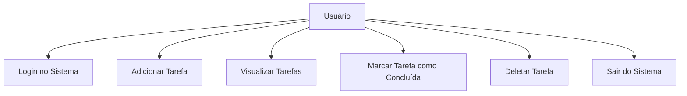

# Organizador de Tarefas

## Diagrama de Casos de Uso
Este é um mapa simples que mostra o que o usuário pode fazer no nosso organizador de tarefas. Ele pode fazer login, adicionar tarefas, ver a lista, marcar como concluído, deletar tarefas ou sair do sistema.

